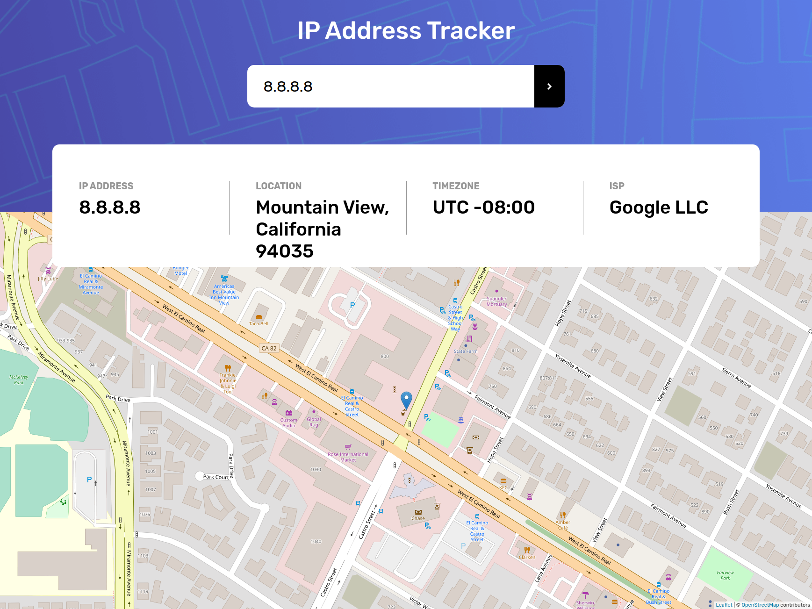

# Frontend Mentor - IP address tracker solution

This is a solution to the [IP address tracker challenge on Frontend Mentor](https://www.frontendmentor.io/challenges/ip-address-tracker-I8-0yYAH0). Frontend Mentor challenges help you improve your coding skills by building realistic projects. 

## Table of contents

- [Overview](#overview)
  - [The challenge](#the-challenge)
  - [Screenshot](#screenshot)
  - [Links](#links)
- [My process](#my-process)
  - [Built with](#built-with)
  - [What I learned](#what-i-learned)
  - [Continued development](#continued-development)
  - [Useful resources](#useful-resources)
- [Author](#author)
- [Acknowledgments](#acknowledgments)


## Overview

### The challenge

Users should be able to:

- View the optimal layout for each page depending on their device's screen size
- See hover states for all interactive elements on the page
- See their own IP address on the map on the initial page load
- Search for any IP addresses or domains and see the key information and location

### Screenshot




### Links

- Solution URL: [Add solution URL here](https://github.com/maperezromero/ip-address-tracker
- Live Site URL: [Add live site URL here](https://clever-joliot-451706.netlify.app/)

## My process

### Built with

- Semantic HTML5 markup
- CSS custom properties
- Flexbox
- CSS Grid
- Mobile-first workflow
- [React](https://reactjs.org/) - JS library
- [LeafletJS](https://leafletjs.com/) - Maps API


### What I learned

I have improve my HTML/CSS skills and also I have used LeafletJS, a great free API by which we can use maps and localize position by coordinates, names, etc.

### Continued development

I think this is the right moment to take the next step and use DDBB.


## Author


- Frontend Mentor - [@maperezromero](https://www.frontendmentor.io/profile/maperezromero)


## Acknowledgments

If you use the marker on the leaflet's API you need to specify the path to the icon. Take my example:
```
import markerIcon from "leaflet/dist/images/marker-icon.png"
import {Icon} from 'leaflet'

<Marker position={[values.lat,values.lng]} icon={new Icon({iconUrl: markerIcon, iconSize: [25, 41], iconAnchor: [12, 41]})} >
        <Popup>You are here</Popup>
</Marker>
```